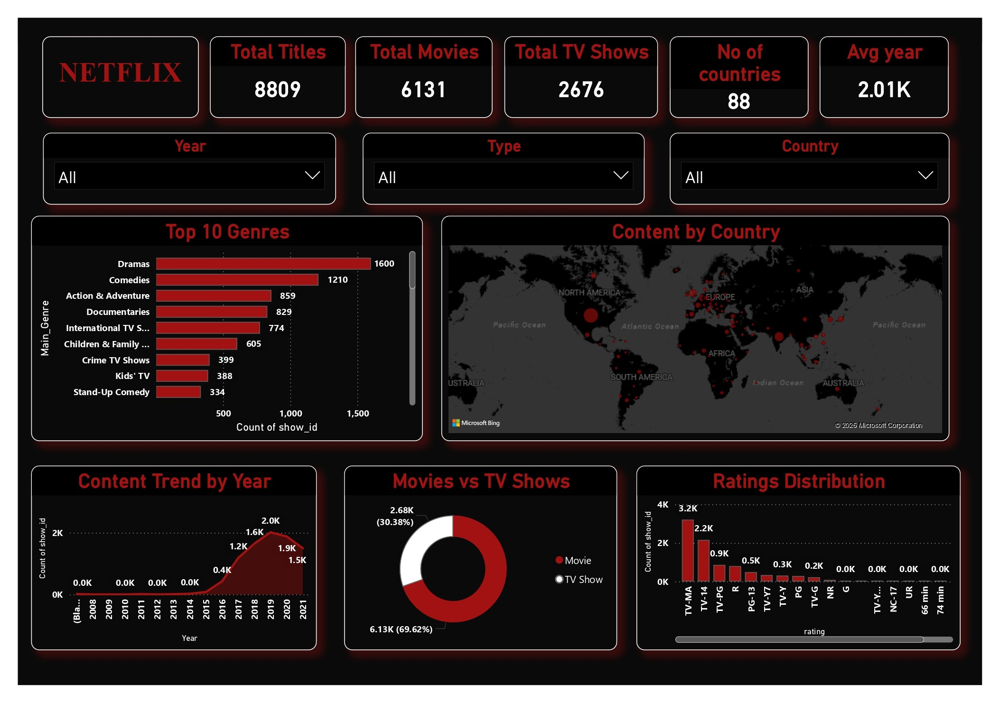
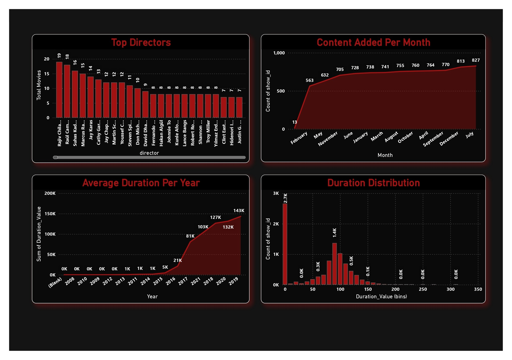

#  Netflix Power BI Dashboard

##  Project Overview
An interactive Power BI dashboard built to analyse Netflix 
content trends using a real-world dataset from Kaggle. 
This project demonstrates skills in data cleaning, 
DAX calculations, and business intelligence storytelling.

##  Dashboard Preview
### Page 1 — Overview

### Page 2 — Deep Dive

##  Key Insights Covered
- Total Titles: 8,809 | Movies: 6,131 | TV Shows: 2,676
- Content spread across 88 countries
- Top genres: Dramas (1600), Comedies (1210), Action & Adventure (859)
- Content peaked in 2019–2020
- Most content added in July (827 titles)
- Top director: Rajiv Chilaka (19 titles)

##  Dashboard Features
- KPI cards for quick business insights
- Interactive slicers (Type, Country, Year)
- Visualisations: Bar chart, Line chart, Donut chart, 
  Map, Histogram
- Two-page layout: Overview + Deep Dive Analysis

##  Tools & Technologies
| Tool | Purpose |
|------|---------|
| Power BI Desktop | Dashboard building |
| Power Query | Data cleaning & transformation |
| DAX | Calculated columns & measures |
| GitHub | Version control & portfolio |

## Dataset
- **Source:** [Netflix Movies and TV Shows — Kaggle](https://www.kaggle.com/datasets/shivamb/netflix-shows)
- **Records:** 8,809 titles

## Key Learnings
- Data transformation using Power Query
- Creating calculated columns and measures using DAX
- Building multi-page interactive dashboards
- Data visualisation and storytelling best practices

## Author
**Rinku Ghosh**  
[LinkedIn](https://www.linkedin.com/in/k-rinku-ghosh3112/) 
| [GitHub](https://github.com/krinkughosh3112-wq)
